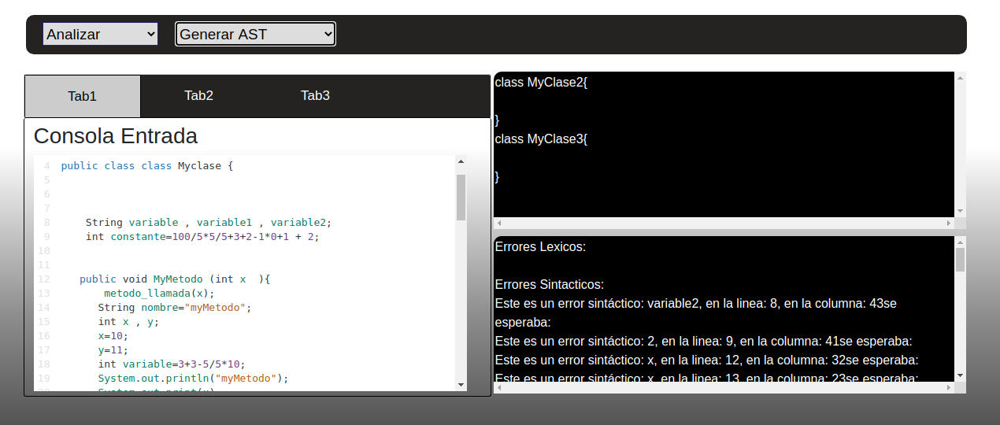
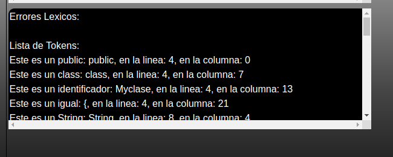
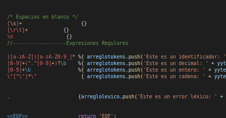

# **Translator in Docker**
PR1 ORGANIZACION DE LENGUAJES Y COMPILADORES 1

**HORACIO CIRAIZ ORELLANA**



## **INDICE**

## **DESCRIPCION**
***

Translator in Docker es una Aplicacion Web que se encarga de analizar codigo Java y traducirlo a Python o JavaScriptD
por medio del uso de deramientas para analisis léxico y sintactico, tecnologias Web Nodejs,desarrollado en lenguaje Go y JavaScript.


## **FRONT-END**
***
La parte del frontend fue desarrollado con distintos lenguajes.

Servidor Frontal desarrollado con Lenguaje Go


>### SERVIDOR GO
Se implemento un servidor desarrollado con lenguaje de programacion Go para la publicacion a continuacion se muestra el codigo utilizado para la publicacion de la pagina en Servidor Go


>### INTERFAZ
Apliacion Web desarrollado con HTML, CSS y metodos fueron realizados con JavaScript para la conexion,recepcion y peticion de datos por parte del cliente 

A continuacion se mostrara una serie de imagenes con el codigo utlizado para la  Aplicacion Web.

Peticiones a NodeJs para el inicio del Analisis 


>### Menu Principal
 *** 
### Abrir 
Este menu permite cargar a la consola principal el archivo a Analizar 


### Guardar
Este menu permite guardar el archio en consola en un documento de texto


### Analizar
Este menu permite iniciar el analisis del codigo Java para su posterior traduccion 


### Consola de Salida JavaScript
La consola inferior derecha es donde se colocaran los disintos errores lexicos,sintacticos y lista de tokens Recuperados de l analisis 





### Menu Descargar 
El menu descargar permite descargar en un archivo Js el codigo Traducido 


## **REPORTES**
***
la Aplicacion cuenta con una serie de Reportes  de Errores Lexicos, Sintacticos ,Tokens y arbol AST en formato de imagen con codigo Graphviz


## **BACK-END**
***

 Desarrollado con tecnologia NodeJs,Express,Core,Morgan y Lenguaje de Programacion JavaScript se implementan conjunto a la herramienta Jison para la creacion de Analizadores Lexicos y Sintacticos 


>### NODE JS
El servidor fue implementado con tecnologia nodejs,express y acontinuacion se describiran los elementos mas importantes de este:

```sh
$ npm install express --save
$ npm install morgan  --save
$ npm install jison
$ npm install cors -g
$ npm install --save-dev nodemon
$ node app
```

el siguiente codigo permite levantar el servidor Nodejs y configurar las distintas partes de este para recibir las peticiones


luego se configura el servidor con una serie de metodos POST para la recepcion de peticiones por parte de la aplicacion Web


y el metodo principal que hace el llamado al metodo que inicia el analisis del documento y la recepccion de erroes


>### ANALIZADORES

**Analizador Lexico**

 El analizador lexico fue desarrollado con la herramienta Jison en un Archivo con nombre Gramatica.jison y a continuacion se mostrara una serie de imagenes con las distintas expresiones regulares utilizadas para este y la declaracion de  palabras reservadas utilizadas para el analisis correcto


 


**Analizador Sintactico**

  El anailzador sintactico fue desarrollado con la herrmaienta Jison en un archivo con nombre Gramatica.jison y a continuacion se proporciona la gramatica utilizada para el correcto reconocimiento del lenguaje.

```sh
INICIO: LISTACLASE EOF ;

LISTACLASE:LISTACLASE CLASE
	|CLASE					
	|LISTACLASE  ERROR SIMBOLO CLASE
	| ERROR SIMBOLO	CLASE;


CLASE:CLASS
	|INTERFACE;

MAIN: public static void main parentesisA string  corcheteA corcheteC args parentesisC llaveA  llaveC
	| public static void main parentesisA string  corcheteA corcheteC args parentesisC llaveA LISTAINSTRUCCIONES llaveC;

CLASS: public class identificador llaveA llaveC  
	|public class identificador llaveA LISTACUERPOCLASS llaveC;
				
LISTACUERPOCLASS:LISTACUERPOCLASS CUERPOCLASS 
				|CUERPOCLASS					
				|LISTACUERPOCLASS  ERROR SIMBOLO CUERPOCLASS
				| ERROR SIMBOLO	CUERPOCLASS	;

CUERPOCLASS:METODOS 
			|FUNCIONES
			|DEC
			|EXP
			|MAIN
			|ASIGNACION;


FUNCIONES:public TIPOVOID identificador parentesisA LISTAPARAMETROS parentesisC pcoma 
		|public TIPOVOID identificador parentesisA  parentesisC pcoma;

//--------------------------------Metodos
METODOS:public TIPOVOID identificador parentesisA LISTAPARAMETROS parentesisC llaveA llaveC	
		|public TIPOVOID identificador parentesisA  parentesisC llaveA llaveC 
		|public TIPOVOID identificador parentesisA LISTAPARAMETROS parentesisC llaveA LISTAINSTRUCCIONES llaveC /--con parametros
		|public TIPOVOID identificador parentesisA  parentesisC llaveA LISTAINSTRUCCIONES llaveC;						

//-----------------------------Interface------------------
INTERFACE: public interface identificador llaveA llaveC 
		|public interface identificador llaveA LISTACUERPOINTERFACE llaveC;

LISTACUERPOINTERFACE:LISTACUERPOINTERFACE CUERPOINTERFACE
					|CUERPOINTERFACE
					|LISTACUERPOINTERFACE  ERROR SIMBOLO CUERPOINTERFACE
					| ERROR SIMBOLO	CUERPOINTERFACE;

CUERPOINTERFACE:FUNCIONES;

//-------------Lista de Instrucciones------
LISTAINSTRUCCIONES:LISTAINSTRUCCIONES INSTRUCCIONES
				|INSTRUCCIONES 
				|LISTAINSTRUCCIONES  ERROR SIMBOLO INSTRUCCIONES
				|ERROR SIMBOLO	INSTRUCCIONES;

INSTRUCCIONES:SENTENCIAS;

SENTENCIAS:	REPETICION
			|CONTROL
			|BREAK
			|CONTINUE
			|RETURN
			|DEC
			|ASIGNACION
			|PRINT
			|EXP 
			|LLAMADA;

LLAMADA: identificador parentesisA LISTAPARAMETROSVALOR parentesisC pcoma
		|identificador parentesisA  parentesisC pcoma;

LISTAPARAMETROSVALOR:LISTAPARAMETROSVALOR coma 	PARAMETROSVALOR
					|PARAMETROSVALOR;			

PARAMETROSVALOR: EXPRESIONRELACIONAL;

EXP: identificador adicion pcoma
	|identificador sustraccion pcoma;


PRINT: print parentesisA EXPRESIONLOGICA parentesisC pcoma;

//-------------Repeticion
REPETICION:FOR
		|WHILE
		|DOWHILE;

//--------------Do While---------------
DOWHILE: do llaveA llaveC while parentesisA EXPRESIONLOGICA parentesisC pcoma 
		|do llaveA LISTAINSTRUCCIONES llaveC while parentesisA EXPRESIONLOGICA parentesisC pcoma;
//--------------While
WHILE: while parentesisA EXPRESIONLOGICA parentesisC llaveA llaveC
	| while parentesisA EXPRESIONLOGICA parentesisC llaveA LISTAINSTRUCCIONES llaveC;
//-----------------For

FOR: for parentesisA DEC  EXPRESIONLOGICA pcoma EXPRESIONLOGICA parentesisC llaveA llaveC
	|for parentesisA DEC  EXPRESIONLOGICA pcoma EXPRESIONLOGICA parentesisC llaveA LISTAINSTRUCCIONES llaveC;

//-------------------Control
CONTROL:IF
		|ELSE
		|ELSEIF;
//------------------if
IF: if parentesisA EXPRESIONLOGICA parentesisC llaveA llaveC
	|if parentesisA EXPRESIONLOGICA parentesisC llaveA LISTAINSTRUCCIONES llaveC;
//-------------------else--------------
ELSE:else llaveA llaveC	
	|else llaveA LISTAINSTRUCCIONES llaveC	;
//------------------else if------------
ELSEIF:else if parentesisA EXPRESIONLOGICA parentesisC llaveA llaveC	
		|else if parentesisA EXPRESIONLOGICA parentesisC llaveA LISTAINSTRUCCIONES llaveC;
//---------------Break
BREAK: break pcoma;
//---------------Continue
CONTINUE: continue	pcoma;
//---------------Return
RETURN: return EXPRESIONLOGICA pcoma		;
//--------------Asignacion---------------
ASIGNACION: identificador igual EXPRESIONLOGICA pcoma;

//--------------Declaracion--------------
DEC:TIPO LISTAIDENTIFICADORES pcoma;

LISTAIDENTIFICADORES: LISTAIDENTIFICADORES coma LISTID 
					|LISTID;

LISTID:identificador igual EXPRESIONLOGICA 											
		|identificador;

//------------_Lista de Parametros
LISTAPARAMETROS:LISTAPARAMETROS coma PARAMETROS 
				|PARAMETROS;


PARAMETROS:TIPO identificador; 

//--------------Tipo/Void
TIPOVOID:VOID 
		|TIPO;
VOID: void;
//--------------Tipo		
TIPO:int 					
	|boolean				
	|double					
	|string					
	|char;
//---------------Expresion Numerica
EXPRESIONNUMERICA:
		menos EXPRESIONNUMERICA %prec umenos		
		|EXPRESIONNUMERICA mas EXPRESIONNUMERICA	
		|EXPRESIONNUMERICA menos EXPRESIONNUMERICA 
		|EXPRESIONNUMERICA por EXPRESIONNUMERICA		
		|EXPRESIONNUMERICA dividido EXPRESIONNUMERICA
		|EXPRESIONNUMERICA adicion
		|EXPRESIONNUMERICA sustraccion 						
		|parentesisA EXPRESIONNUMERICA parentesisC	
		|entero										
		|decimal									
		|cadena										
		|identificador;

EXPRESIONRELACIONAL:
		//--------------Relacionales----------
		EXPRESIONNUMERICA dobleigual EXPRESIONNUMERICA 		
		|EXPRESIONNUMERICA notigual EXPRESIONNUMERICA
		|EXPRESIONNUMERICA mayor EXPRESIONNUMERICA
		|EXPRESIONNUMERICA mayorigual EXPRESIONNUMERICA
		|EXPRESIONNUMERICA menor EXPRESIONNUMERICA
		|EXPRESIONNUMERICA menorigual EXPRESIONNUMERICA
		|EXPRESIONNUMERICA /* esta se puede borrar*/;

EXPRESIONLOGICA:
		//--------------Logicas---------------
		|EXPRESIONRELACIONAL and EXPRESIONRELACIONAL 		
		|EXPRESIONRELACIONAL or EXPRESIONRELACIONAL			
		|EXPRESIONRELACIONAL xor EXPRESIONRELACIONAL		
		|not EXPRESIONRELACIONAL							
		|EXPRESIONRELACIONAL;

ERROR: error  { arreglosintactico.push('Este es un error sintáctico: ' + yytext + ', en la linea: ' + this._$.first_line + ', en la columna: ' + this._$.first_column + "se esperaba: "); console.error('Este es un error sintáctico: ' + yytext + ', en la linea: ' + this._$.first_line + ', en la columna: ' + this._$.first_column); };

SIMBOLO: pcoma
		|parentesisC
		|llaveC	;

```
